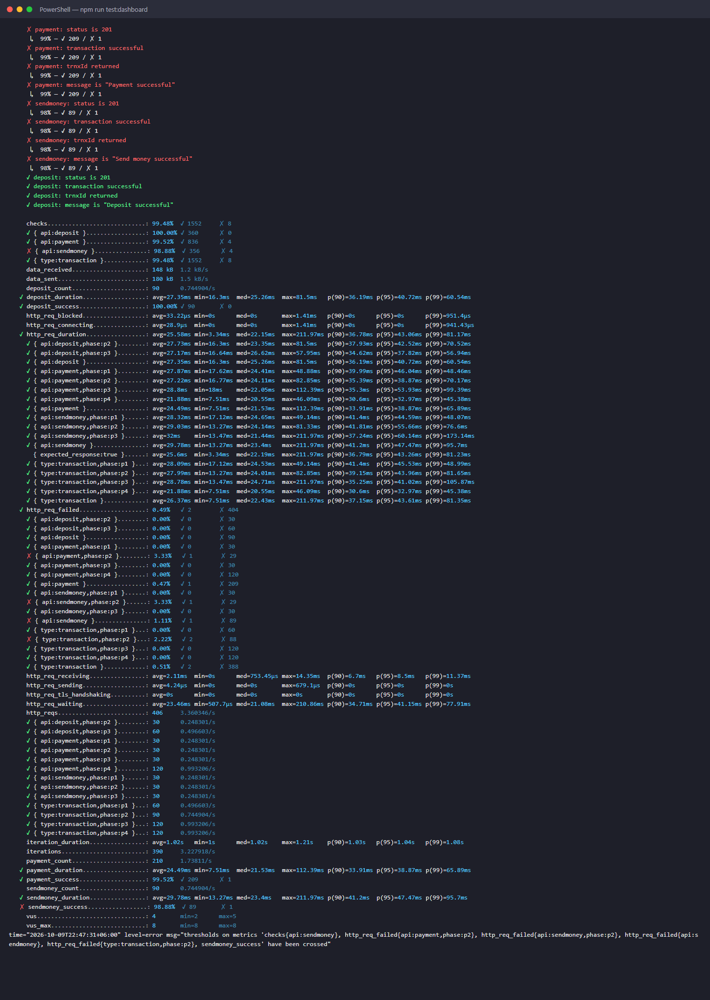
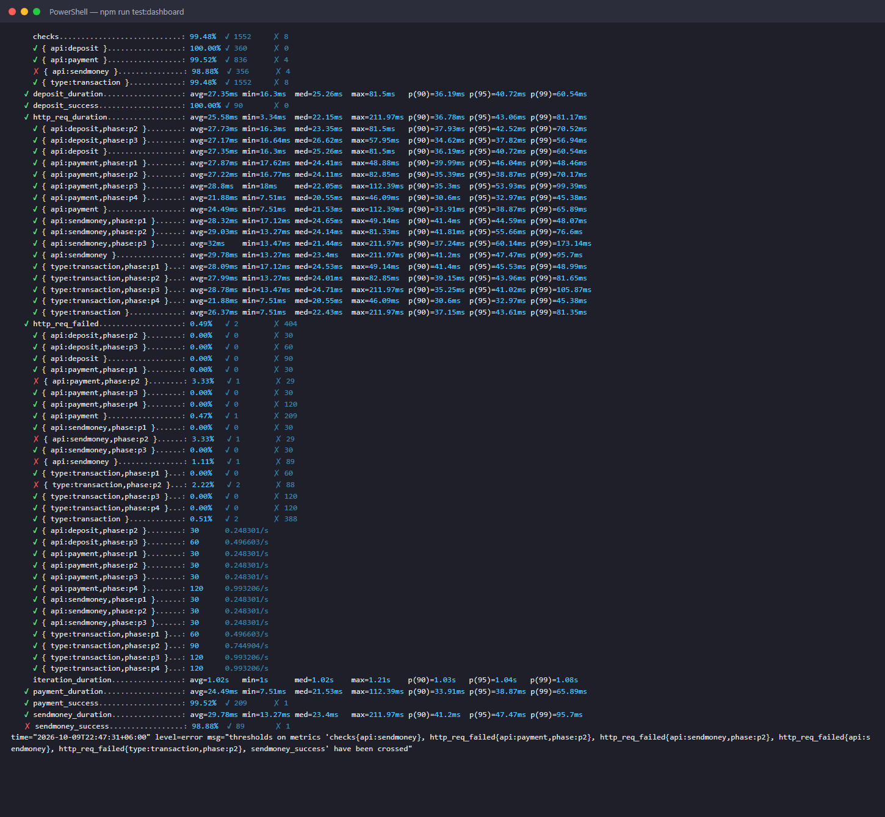
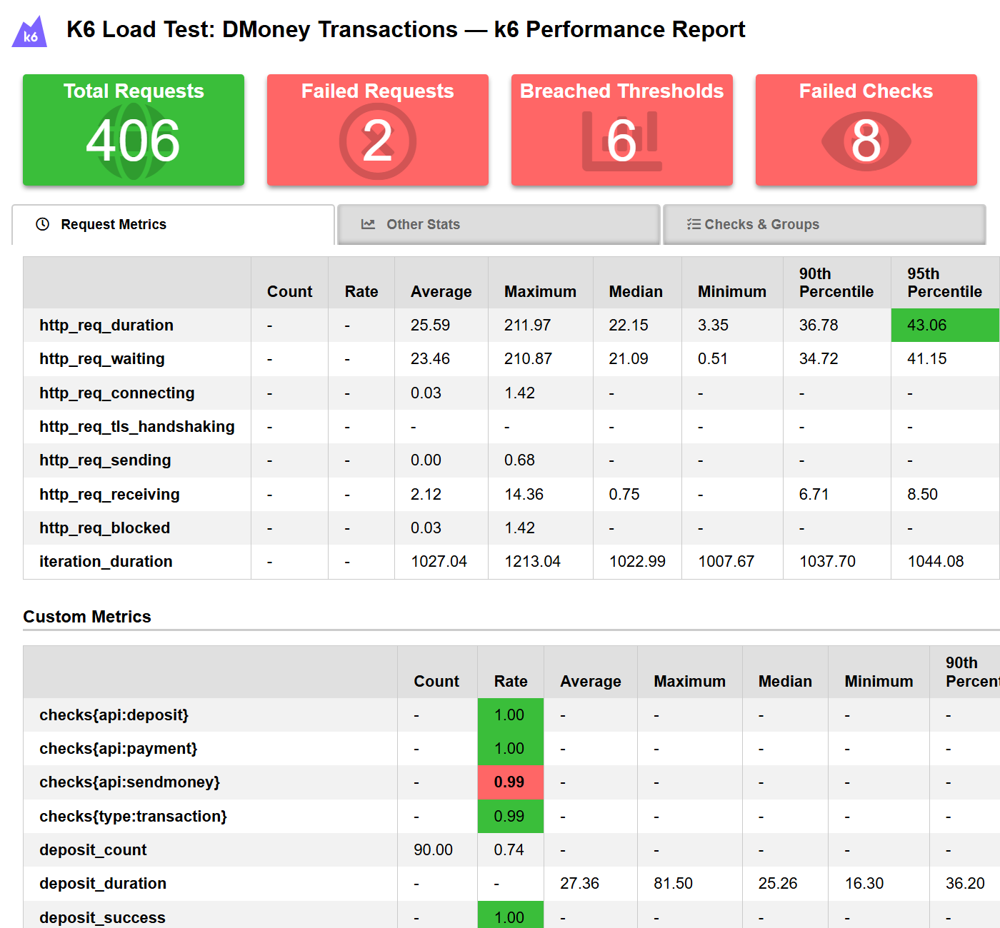
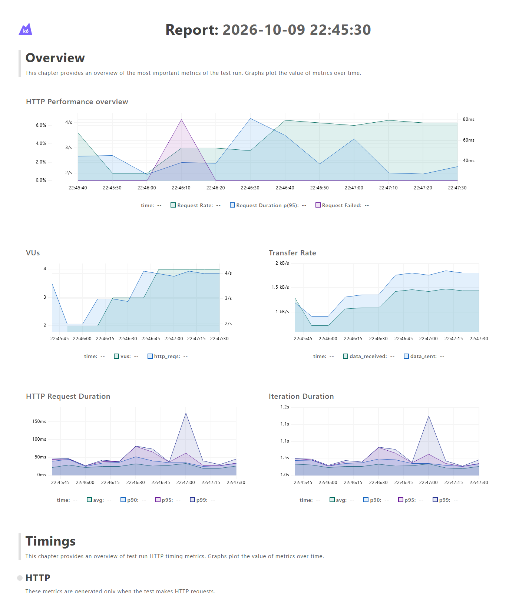
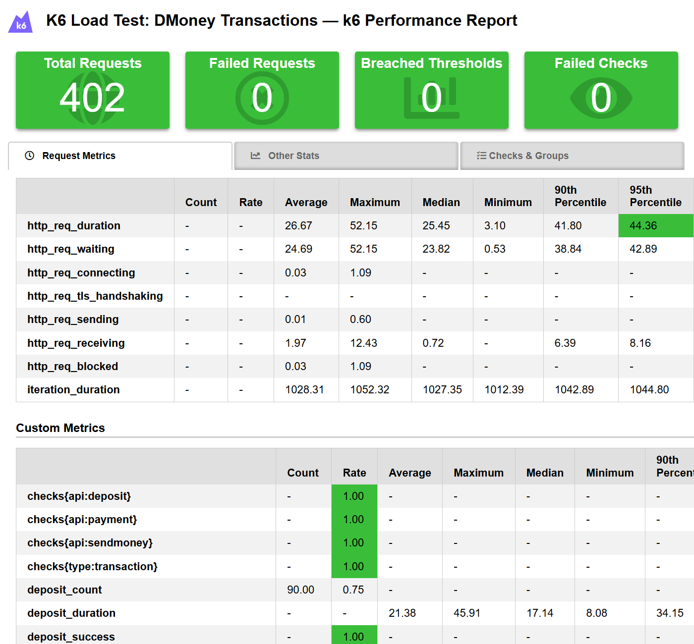
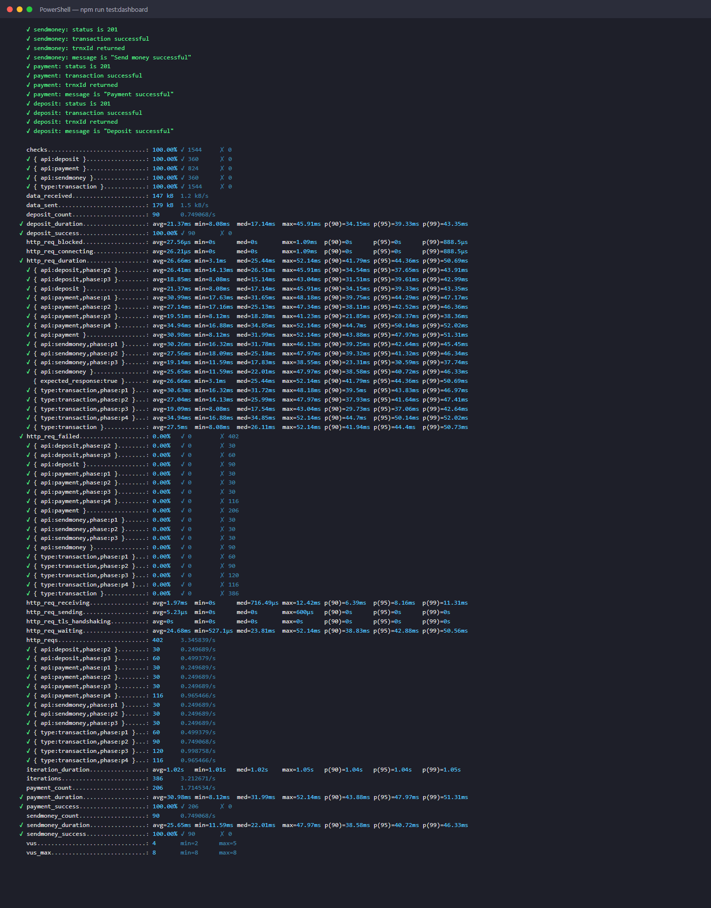

# DMoney Transactions: k6 Performance Test

A k6 test that drives the DMoney deposit, send money and payment APIs with six users (2 agents, 2 customers, 2 merchants) for 2 minutes. The workload changes every 30 seconds, and the test compares how the three APIs behave as it changes.

**Batch 19, Performance Testing assignment.**

| | |
|---|---|
| Tool | [k6](https://k6.io) v2.2.0 |
| System under test | `dmoney-transaction-api` (Node.js / Express / Sequelize / MySQL 8), copied into this repo and run locally on port 5000 |
| Reports | k6-reporter HTML report, k6 web dashboard export, JSON summary |

## Contents

- [Scenario](#scenario)
- [Project structure](#project-structure)
- [How to run](#how-to-run)
- [Test design](#test-design)
- [Checks and thresholds](#checks-and-thresholds)
- [Results](#results)
- [Performance analysis](#performance-analysis)
- [Screenshots](#screenshots)
- [Conclusion](#conclusion)

## Scenario

Each user logs in with their own credentials. Flows in the same 30-second window run at the same time, and keep running for the whole window.

| Window | Flow | API |
|---|---|---|
| **0–30s** | Customer 1 → Customer 2 | `POST /transaction/sendmoney` |
| | Customer 2 → Merchant 1 | `POST /transaction/payment` |
| **30–60s** | Customer 2 → Customer 1 | `POST /transaction/sendmoney` |
| | Agent 1 → Customer 2 | `POST /transaction/deposit` |
| | Customer 1 → Merchant 1 | `POST /transaction/payment` |
| **60–90s** | Agent 1 → Customer 1 | `POST /transaction/deposit` |
| | Agent 2 → Customer 2 | `POST /transaction/deposit` |
| | Customer 1 → Customer 2 | `POST /transaction/sendmoney` |
| | Customer 2 → Merchant 2 | `POST /transaction/payment` |
| **90–120s** | Agent 1 → Merchant 1 | `POST /transaction/payment` |
| | Agent 2 → Merchant 2 | `POST /transaction/payment` |
| | Customer 1 → Merchant 1 | `POST /transaction/payment` |
| | Customer 2 → Merchant 2 | `POST /transaction/payment` |

## Project structure

```
K6/
├── tests/dmoney-transactions.js   # k6 script: scenarios, thresholds, setup(), flows, handleSummary()
├── lib/
│   ├── auth.js                    # login + OTP verification, auth headers
│   └── transactions.js            # deposit / sendmoney / payment request, checks, custom metrics
├── setup/
│   ├── seed.js                    # creates, activates and funds the 6 test users -> config/users.json
│   ├── prepare-db.js              # raises the Customer daily/monthly limits in the local test DB (backs up originals)
│   ├── restore-db.js              # restores the original limits
│   └── account-index.js           # experiment: adds/drops an index on Transactions.account
├── scripts/
│   ├── run-k6.js                  # runs k6 (finds k6.exe on Windows), optional web dashboard export
│   ├── compare.js                 # turns summary.json into the comparison tables below
│   └── render-terminal.js         # renders the saved console output for screenshots
├── config/users.example.json      # shape of config/users.json (the real file is git-ignored)
├── reports/
│   ├── baseline-run-2/            # main result: summary.html, dashboard.html, summary.json, run-output.txt, comparison.md
│   ├── baseline-run-1/            # repeat of the baseline
│   └── with-account-index/        # experiment run after adding the missing DB index
├── screenshots/
├── dmoney-transaction-api/        # copy of the API under test
├── .env.example
└── package.json
```

## How to run

### Prerequisites

- [k6](https://grafana.com/docs/k6/latest/set-up/install-k6/): `winget install k6` (Windows) or `brew install k6` (macOS)
- Node.js 18+ (used for the setup scripts; k6 itself doesn't need Node)
- MySQL 8 with the DMoney database (`dmoneydb`) and its migrations applied

### 1. Start the API

```powershell
cd dmoney-transaction-api
copy .env.example .env      # fill in DB credentials, ACCESS_TOKEN_SECRET, PARTNER_KEY ...
# set SEND_MAIL=false so test logins and registrations don't send real emails
npm install
npm start                   # http://localhost:5000
```

### 2. Configure the test

```powershell
cd ..
npm install
copy .env.example .env      # BASE_URL, SECRET_KEY (= PARTNER_KEY), DEFAULT_OTP, admin/SYSTEM logins, DB credentials
```

### 3. Prepare data and run

```powershell
npm run prepare-db       # raise Customer txn limits in the LOCAL test DB (originals saved to setup/limits-backup.json)
npm run seed             # create/activate/fund the 6 users, writes config/users.json
npm run test:dashboard   # 2-minute run + reports/summary.html + reports/dashboard.html
npm run compare          # print the comparison tables from reports/summary.json
npm run restore-db       # put the original limits back
```

`npm run perf` runs prepare-db, seed, test:dashboard and compare in one go. You can also call k6 directly: `k6 run tests/dmoney-transactions.js`.

You can tune the run with environment variables (`k6 run -e VUS=2 ...`): `VUS` (VUs per flow, default 1), `THINK_TIME` (seconds between iterations, default 1) and `AMOUNT` (tk per transaction, default 10).

## Test design

- **One scenario per flow.** All 13 flows are separate `constant-vus` scenarios with `startTime` 0s / 30s / 60s / 90s and `duration: 30s`. That gives the exact windows above, with flows in the same window running concurrently. Each scenario has its own `exec` function, such as `c1SendC2_p1` or `a1DepC2_p2`.
- **Own credentials per user.** `setup()` logs in all six users through `POST /user/login`, followed by `POST /user/verify-otp` (Customer, Agent and Merchant accounts require an OTP). The tokens are passed to the flows. Login requests are tagged `type:auth`, so they never count in transaction metrics.
- **Tags.** Every transaction request is tagged `api` (deposit/sendmoney/payment), `phase` (p1–p4) and `flow`. This makes it possible to split metrics and thresholds per API, per window, and per API and window.
- **Custom metrics.** For each API there is a Trend (`*_duration`), a Rate (`*_success`) and a Counter (`*_count`).
- **Test data is part of the test.** Two business rules in the API would otherwise make most requests fail for reasons unrelated to performance:
  1. Customers may only make **10 outgoing transactions per day and 50 per month** (`TransactionLimits` table). One run makes about 120 per customer. `prepare-db` raises these limits **in the local test DB only**, and `restore-db` puts them back.
  2. A deposit is refused once a customer's balance reaches **10,000 tk**, and every transaction needs enough balance to cover the amount plus fees (5 tk for send money, 1% with a 5 tk minimum for payment). `seed` keeps customers at about 3,000 tk and agents at 6,000 tk or more. `setup()` checks every payer's balance against a worst-case estimate and aborts if anyone is underfunded.
- **Think time.** There is 1s of think time between iterations, so each flow sends about 1 request per second.

## Checks and thresholds

Every transaction response is checked for:

| Check | Rule |
|---|---|
| Expected HTTP status | `status === 201` |
| Transaction successful | JSON body, no `error`, message contains "successful" |
| Transaction ID returned | `trnxId` is a non-empty string |
| Expected success message | exactly `Deposit successful` / `Send money successful` / `Payment successful` |

Thresholds:

| Scope | Thresholds |
|---|---|
| Global (assignment) | `http_req_failed: rate<0.01`, `http_req_duration: p(95)<1000`, `checks{type:transaction}: rate>=0.99` |
| Deposit | `http_req_duration{api:deposit} p(95)<1000`, `http_req_failed{api:deposit} rate<0.01`, `checks{api:deposit} rate>=0.99`, `deposit_success rate>=0.99`, `deposit_duration p(95)<1000` |
| Send Money | the same five, for `sendmoney` |
| Payment | the same five, for `payment` |
| Per window | `p(95)<1000` and `rate<0.01` for each window, and for each API in each window |

59 thresholds in total. The `http_reqs{...}: count>0` entries always pass. They are only there to make per-window request counts appear in the summary.

## Results

All numbers come from real runs on 2026-10-09 against the local API (Windows 11, MySQL 8.0, k6 v2.2.0). The main result is **baseline run 2** ([HTML report](reports/baseline-run-2/summary.html), [dashboard](reports/baseline-run-2/dashboard.html), [raw tables](reports/baseline-run-2/comparison.md)).

### Per-API comparison (baseline run 2)

| API | Requests | Throughput | Avg | Median | p(90) | p(95) | Max | Failure rate | Check pass rate |
|---|---|---|---|---|---|---|---|---|---|
| Deposit | 90 | 0.74 req/s | 27.36 ms | 25.26 ms | 36.20 ms | 40.72 ms ✅ | 81.50 ms | 0.00% ✅ | 100.00% ✅ |
| Send Money | 90 | 0.74 req/s | 29.79 ms | 23.41 ms | 41.20 ms | 47.48 ms ✅ | 211.97 ms | **1.11% ❌** | **98.89% ❌** |
| Payment | 210 | 1.74 req/s | 24.49 ms | 21.53 ms | 33.92 ms | 38.87 ms ✅ | 112.39 ms | 0.48% ✅ | 99.52% ✅ |
| **All transactions** | 390 | 3.23 req/s | 26.37 ms | 22.44 ms | 37.15 ms | 43.62 ms ✅ | 211.97 ms | 0.51% ✅ | 99.49% ✅ |

**Thresholds: 53 of 59 passed.** The six that failed are all caused by the same two failed requests. Both were HTTP 500 errors with the message `Deadlock found when trying to get lock; try restarting transaction`: one send money (C2 → C1) and one payment (C1 → M1), both in the 30–60s window.

- `http_req_failed{api:sendmoney}` 1.11%, `checks{api:sendmoney}` 98.89%, `sendmoney_success` 98.89%
- `http_req_failed{phase:p2}` 2.22%, and for each API in p2: send money 3.33%, payment 3.33%

The **global** assignment thresholds passed: failed requests 0.49% < 1%, p95 43 ms < 1000 ms, transaction checks 99.49% ≥ 99%.

### Per window: how the workload changed (baseline run 2)

| Window | Concurrent flows | Requests | Throughput | Avg | p(95) | Max | Failure rate |
|---|---|---|---|---|---|---|---|
| 0–30s | 2 (send, pay) | 60 | 2.00 req/s | 28.10 ms | 45.54 ms | 49.15 ms | 0.00% |
| 30–60s | 3 (send, deposit, pay) | 90 | 3.00 req/s | 28.00 ms | 43.97 ms | 82.86 ms | **2.22%** |
| 60–90s | 4 (2 deposits, send, pay) | 120 | 4.00 req/s | 28.79 ms | 41.02 ms | **211.97 ms** | 0.00% |
| 90–120s | 4 (all payments) | 120 | 4.00 req/s | 21.88 ms | 32.98 ms | 46.09 ms | 0.00% |

| API | Window | Requests | Avg | p(95) | Max | Failure rate |
|---|---|---|---|---|---|---|
| Deposit | 30–60s | 30 | 27.74 ms | 42.52 ms | 81.50 ms | 0.00% |
| Deposit | 60–90s | 60 | 27.17 ms | 37.83 ms | 57.95 ms | 0.00% |
| Send Money | 0–30s | 30 | 28.33 ms | 44.60 ms | 49.15 ms | 0.00% |
| Send Money | 30–60s | 30 | 29.03 ms | 55.66 ms | 81.34 ms | 3.33% |
| Send Money | 60–90s | 30 | 32.00 ms | 60.15 ms | 211.97 ms | 0.00% |
| Payment | 0–30s | 30 | 27.87 ms | 46.04 ms | 48.89 ms | 0.00% |
| Payment | 30–60s | 30 | 27.22 ms | 38.87 ms | 82.86 ms | 3.33% |
| Payment | 60–90s | 30 | 28.80 ms | 53.93 ms | 112.39 ms | 0.00% |
| Payment | 90–120s | 120 | 21.88 ms | 32.98 ms | 46.09 ms | 0.00% |

### Reproducibility (baseline run 1)

The first baseline run ([report](reports/baseline-run-1/summary.html)) gave the same picture. p95 was 37.7 ms overall, and there were again **2 deadlock failures out of 390** (0.51%). This time they happened in the 60–90s window: one send money (C1 → C2) and one payment (C2 → M2). Send money again crossed its 1% failure threshold (1.11%), while all latency thresholds passed.

## Performance analysis

### Response time
All three APIs are fast at this load. Every p95 is between 39 and 48 ms, about 20× under the 1000 ms limit. **Send money is the slowest API**, with the highest average (29.8 ms), p95 (47.5 ms) and max (212 ms). **Payment is the fastest** (24.5 ms avg). Send money does the most work per request: it runs the customer limit check (an extra aggregate query over the ledger), locks and sums the sender's balance, and writes three ledger rows (debit, credit, fee). Both of its accounts are customers who are often active in other flows at the same time.

### Throughput
Throughput follows the workload design (1 VU per flow, 1 s think time), not a server limit. It went 2 → 3 → 4 → 4 req/s across the windows, which is exactly the number of concurrent flows. Payment had the most traffic (210 requests, 1.74 req/s) because it runs in all four windows. Deposit and send money each had 90 requests (0.74 req/s).

### Failure rate
The 2 failures per run are **not caused by load**: the server handles about 4 req/s easily. They are **MySQL deadlocks** that happen whenever two concurrent transactions touch the same account:

- In 30–60s, Customer 1 receives money (C2 → C1) while also paying (C1 → M1).
- In 60–90s, Customer 2 receives send money from C1 and a deposit from Agent 2 while also paying Merchant 2.

### Degradation as the workload changes
- **Average latency stayed flat** (about 22–29 ms) from 2 to 4 concurrent flows.
- **Tail latency and errors got worse when flows share an account.** The windows where one customer is both payer and receiver (p2 and p3) had the deadlock errors, the highest maximums (82 ms, 212 ms), and the worst p95 for send money (55.7 → 60.2 ms) and payment in p3 (53.9 ms). Send money's p99 in p3 was 173 ms, against 48 ms in p1.
- **The 90–120s window, with only payments, was the fastest** (p95 33 ms) even though it had the same 4 flows as p3. Each payer there pays a different merchant, and agent payments skip the customer limit query, so there is little lock contention.

### Root cause (from the API code and `SHOW ENGINE INNODB STATUS`)
All three controllers read the balance with:

```sql
SELECT COALESCE(SUM(credit) - SUM(debit), 0) FROM Transactions WHERE account = ? FOR UPDATE
```

`Transactions.account` has **no index** (only the primary key exists). So every `FOR UPDATE` scans the whole ledger and briefly locks rows belonging to *other* accounts. When two transactions scan at the same time, they lock rows in a conflicting order and InnoDB kills one of them as a deadlock victim, which the API returns as HTTP 500. The same full scan also means **every transaction gets slower as the ledger grows**. The balance is recomputed with `SUM()` over the whole table each time.

### Experiment: add the missing index
To confirm the cause, the identical test was rerun after adding `CREATE INDEX ... ON Transactions(account)` to the local test DB (`npm run index:add`). Nothing else changed: same script, same thresholds, same load ([report](reports/with-account-index/summary.html)).

| | Baseline run 1 | Baseline run 2 | With `account` index |
|---|---|---|---|
| Transaction requests | 390 | 390 | 386 |
| Failed requests | 2 (deadlocks) | 2 (deadlocks) | **0** |
| Check pass rate | 99.49% | 99.49% | **100%** |
| p95 (all transactions) | 37.68 ms | 43.62 ms | 44.41 ms |
| Max | 73.11 ms | 211.97 ms | **52.15 ms** |
| Thresholds passed | 30/33* | 53/59 | **59/59** |

\*Run 1 used an earlier version of the script with fewer per-window thresholds.

With the index, the deadlocks and the 100–200 ms latency spikes disappeared. Median and p95 latency stayed in the same range, because at this load the table is small enough that the scan itself is cheap. **Recommendation for the DMoney API:** add an index on `Transactions(account)`, preferably a migration for `(account, createdAt)`, which also helps `limitChecker`. Retry transactions that fail with deadlock error 1213 instead of returning 500. In the longer term, store a running balance instead of recomputing `SUM()` over the ledger on every request.

## Screenshots

### End-of-test metrics (baseline run 2)


### Thresholds and per-API / per-window metrics


### HTML report (k6-reporter)


### k6 web dashboard export


### Experiment run with the account index: all thresholds pass



The terminal screenshots are rendered from the saved console output of each run (`reports/*/run-output.txt`) with `scripts/render-terminal.js`. The report screenshots are the generated HTML files opened in a browser.

## Conclusion

- At the assignment's workload, **deposit, send money and payment all respond in under 50 ms at p95**. The global thresholds pass: failure rate 0.49%, p95 43 ms, transaction checks 99.49%.
- **Send money is the weakest API.** It has the highest latency, and in both baseline runs it crossed its own 1% failure threshold.
- The degradation seen when the workload changes is not caused by request volume. It comes from **lock contention on shared accounts**: a missing index turns every balance lookup into a full-table locking scan, which causes deadlocks (HTTP 500) and tail-latency spikes. Adding the index removed all failures in the experiment run.

### Limitations
- The load is light (about 4 req/s), as the scenario specifies. The test shows correctness under concurrency, not maximum capacity. Raise `VUS` or lower `THINK_TIME` for a stress test.
- The test runs against a local single-node API and MySQL. Network latency and production hardware will change the absolute numbers.
- Customer limits are raised during the test so the business rules don't hide performance behaviour. Run `npm run restore-db` afterwards.
