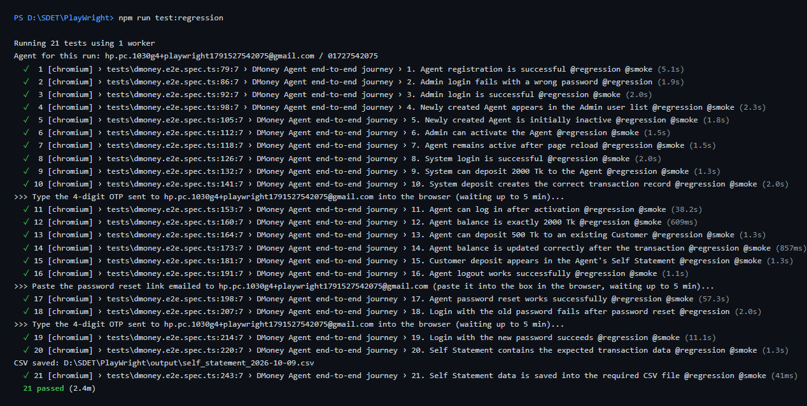
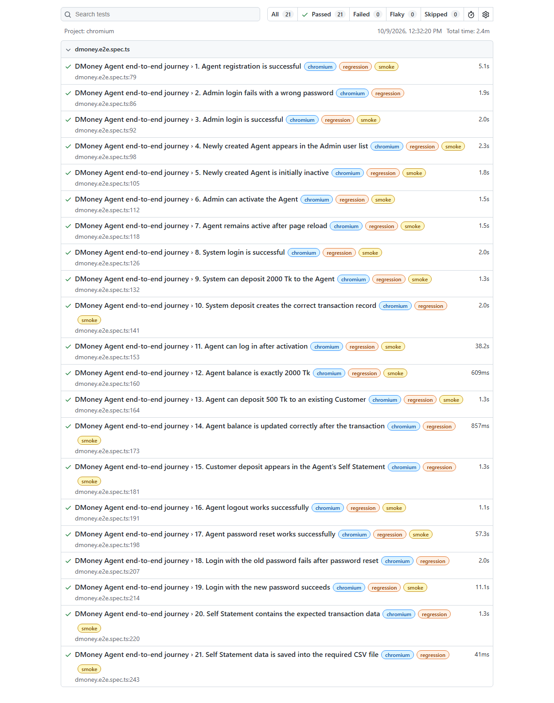
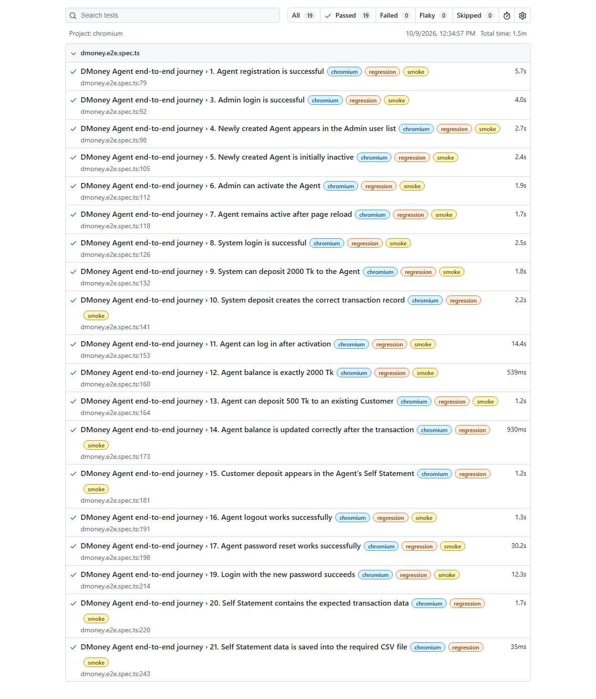

# DMoney Portal — Playwright E2E Automation

End-to-end automation of the Agent journey on **[dmoneyportal.roadtocareer.net](https://dmoneyportal.roadtocareer.net)** with Playwright + TypeScript (Page Object Model).
Batch 19 · Topic: Playwright.

## Contents

- [Scenario](#scenario)
- [Test cases](#test-cases)
- [Tech stack](#tech-stack)
- [Project structure](#project-structure)
- [Setup](#setup)
- [How to run](#how-to-run)
- [Output — Self Statement CSV](#output--self-statement-csv)
- [Headed run video](#headed-run-video)
- [Regression Test Result](#regression-test-result)
- [SmokeTest Result](#smoketest-result)
- [Notes](#notes)

## Scenario

One serial test journey, run in a single browser session:

1. Open the DMoney Portal and go to **Sign Up**.
2. Register a new user with the **Agent** role.
3. Log in as **Admin** (`admin@dmoney.com` / `1234`), find the new Agent and **activate** it, then log out.
4. Log in as **System** (`system@dmoney.com` / `1234`), **deposit 2000 Tk** to the Agent, then log out.
5. Log in as the **Agent**, verify the balance is **2000 Tk**.
6. **Deposit 500 Tk** to an existing Customer and verify the transaction, then log out.
7. **Reset the Agent password** via *Forgot password*, verify the **old password fails** and the **new password works**.
8. Open **Self Statement**, extract every row of the table and save it as `output/self_statement_<YYYY-MM-DD>.csv`.

## Test cases

| # | Test | Type | Suites |
|---|---|---|---|
| 1 | Agent registration is successful | Positive | Regression, Smoke |
| 2 | Admin login fails with a wrong password | Negative | Regression |
| 3 | Admin login is successful | Positive | Regression, Smoke |
| 4 | Newly created Agent appears in the Admin user list | Positive | Regression, Smoke |
| 5 | Newly created Agent is initially inactive (PENDING) | Positive | Regression, Smoke |
| 6 | Admin can activate the Agent | Positive | Regression, Smoke |
| 7 | Agent remains active after page reload | Positive | Regression, Smoke |
| 8 | System login is successful | Positive | Regression, Smoke |
| 9 | System can deposit 2000 Tk to the Agent | Positive | Regression, Smoke |
| 10 | System deposit creates the correct transaction record | Positive | Regression, Smoke |
| 11 | Agent can log in after activation | Positive | Regression, Smoke |
| 12 | Agent balance is exactly 2000 Tk | Positive | Regression, Smoke |
| 13 | Agent can deposit 500 Tk to an existing Customer | Positive | Regression, Smoke |
| 14 | Agent balance is updated correctly after the transaction | Positive | Regression, Smoke |
| 15 | Customer deposit appears in the Agent's Self Statement | Positive | Regression, Smoke |
| 16 | Agent logout works successfully | Positive | Regression, Smoke |
| 17 | Agent password reset works successfully | Positive | Regression, Smoke |
| 18 | Login with the old password fails after password reset | Negative | Regression |
| 19 | Login with the new password succeeds | Positive | Regression, Smoke |
| 20 | Self Statement contains the expected transaction data | Positive | Regression, Smoke |
| 21 | Self Statement data is saved into the required CSV file | Positive | Regression, Smoke |

Suites are Playwright tags: every test has `@regression`; positive tests also have `@smoke`.

## Tech stack

- [Playwright Test](https://playwright.dev/) + TypeScript
- Page Object Model
- [Faker](https://fakerjs.dev/) for unique Agent data
- dotenv for configuration

## Project structure

```
PlayWright/
├─ pages/                    # Page Objects
│  ├─ BasePage.ts            # header balance, logout, alerts
│  ├─ RegisterPage.ts
│  ├─ LoginPage.ts           # login + OTP step
│  ├─ AdminUsersPage.ts      # search, view, activate users
│  ├─ CashInPage.ts          # SYSTEM → Agent and Agent → Customer deposits
│  ├─ SelfStatementPage.ts   # table scraping across pages
│  └─ PasswordResetPage.ts   # forgot / reset password
├─ tests/
│  └─ dmoney.e2e.spec.ts     # the 21 tests (serial)
├─ utils/
│  ├─ dataGenerator.ts       # Agent data, money parser, date stamp
│  ├─ csvWriter.ts           # write / read the Self Statement CSV
│  └─ manualInput.ts         # OTP / reset-link entry during headed runs
├─ output/                   # self_statement_<YYYY-MM-DD>.csv
├─ docs/                     # video + result screenshots used in this README
├─ playwright.config.ts
├─ .env.example
└─ package.json
```

## Setup

```bash
npm ci
npx playwright install chromium
cp .env.example .env
```

Edit `.env`:

| Variable | Meaning |
|---|---|
| `BASE_URL` | Portal URL |
| `ADMIN_EMAIL` / `ADMIN_PASSWORD` | Admin account |
| `SYSTEM_EMAIL` / `SYSTEM_PASSWORD` | System account |
| `CUSTOMER_PHONE` | Phone number of an existing, active Customer (receives the 500 Tk) |
| `AGENT_PASSWORD` / `AGENT_NEW_PASSWORD` | Agent password before and after the reset |
| `GMAIL_ADDRESS` | A Gmail inbox you can open (see below) |

## How to run

```bash
npm run test:regression   # all 21 tests, headed
npm run test:smoke        # 19 positive tests, headed
npm run report            # open the last HTML report
```

**Email steps.** The portal sends Agent login OTPs and the password-reset link only by email, and only to Gmail addresses.
Each run registers a fresh Agent as `<GMAIL_ADDRESS user>+playwright<timestamp>@gmail.com`, so every mail lands in your inbox.
During the headed run the test pauses three times:

1. **Test 11** — type the 4-digit login OTP into the OTP field in the browser.
2. **Test 17** — paste the reset link from the *Password Reset Request* email into the box shown on the page.
3. **Test 19** — type the new login OTP.

## Output — Self Statement CSV

File: [`output/self_statement_2026-10-09.csv`](output/self_statement_2026-10-09.csv)

```csv
"Transaction ID","Sender Account","Receiver Account","Type","Debit","Credit","Balance","Date"
"TXNXZORPMHJQB","SYSTEM","01727699261","Top-up from SYSTEM","-","2000.00","2000.00","09/10/2026, 12:35:22"
"TXNS9GQAJ7U1L","01727699261","01798402146","Deposit Commission","500.00","12.50","1512.50","09/10/2026, 12:35:40"
```

## Headed run video

Full regression run in headed mode, one continuous browser session:

**[▶ docs/dmoney-regression-headed.webm](docs/dmoney-regression-headed.webm)**

## Regression Test Result

`npm run test:regression` — **21 passed**





## SmokeTest Result

`npm run test:smoke` — **19 passed** (positive tests only)




## Notes

- **Commission:** an Agent earns 2.5% on a Customer deposit, so after depositing 500 Tk the Agent balance is `2000 − 500 + 12.50 = 1512.50`. Test 14 asserts this value.
- **Inactive state:** new users are created with status `PENDING`; test 5 checks it in the Admin user list and on the user's detail page.
- **Unique data:** each run creates a new Agent (new email and phone), so runs can be repeated without cleanup.
